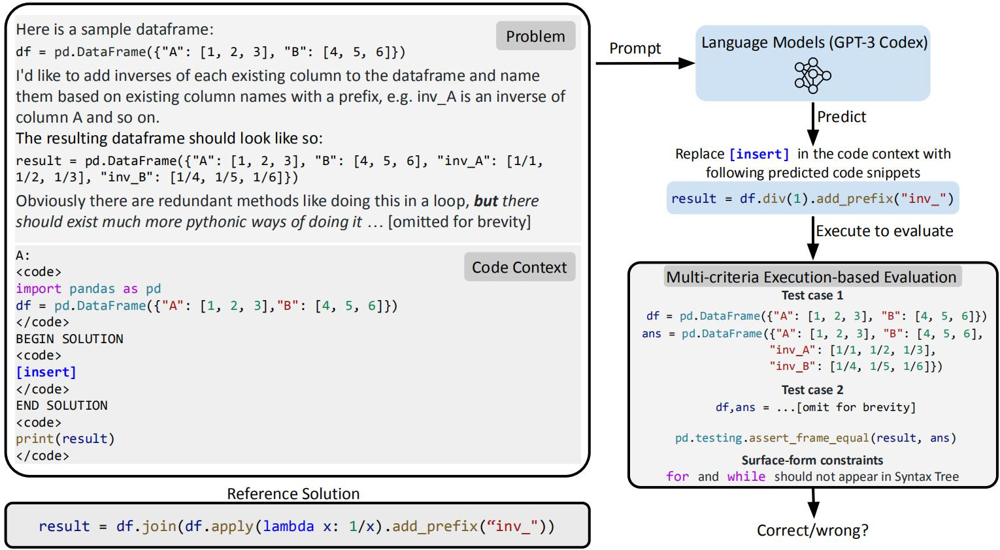

# Evaluating DS1000



## Introduction

DS-1000 is a code generation benchmark with a thousand data science questions spanning seven Python libraries that (1) reflects diverse, realistic, and practical use cases, (2) has a reliable metric, (3) defends against memorization by perturbing questions.[[1]](https://ds1000-code-gen.github.io/)

Here are the results of our models. Although it is not fully fair to compare our models using different prompt, it is sufficient to say our models show comparable ability with GPT-3.5-turbo and Code-davinci-002 to help users to gain knowledge and provide solutions to those questions about common python packages. 

| Model | Size | Matplotlib | Numpy | Pandas | Pytorch | Scipy | Sklearn | Tensorflow | Overall |
|----|----|----|----|----|----|----|----|----|----|
|# of Problems|   | 155 | 220 | 291 | 68  |  106  |  115 | 45 | 1000 |
|----------------------|----|------------|--------|--------|---------|------|--------|-------------|--------|
|Code-Cushman-001[[2]](https://arxiv.org/pdf/2306.08568.pdf)| Nan | 40.7 | 21.8 | 7.9  | 12.4 |  11.3  | 18.0 | 12.2 | 18.1 |
| StarCoder[[3]](https://arxiv.org/pdf/2305.06161.pdf) | 15B | 51.7 | 29.7 | 11.4  | 21.4 |  20.2  | 29.5 | 24.5 | 26.0 |
| WizardCoder[[2]](https://arxiv.org/pdf/2306.08568.pdf) | 15B | 55.2 | 33.6 | 16.7  | 26.2 |  24.2  | 24.9 | 26.7 | 29.2 |
| Code-davinci-002[[4]](https://github.com/xlang-ai/DS-1000) | Nan | 55.5 | 44.6 | 26.5  | 39.7 |  32.1  | 46.1 | 40.0 | 39.3 |
| GPT-3.5-turbo | Nan | 6.45(fail) | 30.0 |  19.24   | 17.65  |  19.81   |  19.13 | 33.33  | 20.2   |
| GPT-4 | Nan | 65.16 | 60.0  |  46.74  |  38.24 |  42.45   |  55.65 | 51.11  | 52.7  |
|----------------------|----|------------|--------|--------|---------|------|--------|-------------|--------|
| **XwinCoder** | 7B |  46.5  |  32.7  | 19.9 |  22.1  | 17.9 | 20.9 | 22.2 | 27.0 |
| **XwinCoder** | 13B | 61.9 | 42.3 | 21.7 | 38.2 | 26.4 | 31.3 | 26.7 | 35.4 |
| **XwinCoder** | 33B | 58.71 | 48.64  | 29.21 | 39.71 | 36.79  | 45.22 | 24.44 | 41.2 |


## How to Evaluate

The original DS1000 dataset was designed for pretrained models. However, after instruction finetuning, the performance of directly using original dataset's prompt and continue to generate drop to very low. This may be because the complicts of system prompt formats. We evaluate the true ability of instruction finetuned model by hacking the prompt format into ours, i.e., change `A:` in origianl prompts into ours `<AI>: ` and change `<code>` into " ``` ".

### 1. Generate Responses
Download data and unzip from original [repository](https://github.com/HKUNLP/DS-1000/blob/main/ds1000_data.zip) and unzip it. Then set model name and run:
```bash
bash generate_ds1000.sh
```
### 2. Check Correctness
Evaluating using [bigcode-evaluation-harness](https://github.com/bigcode-project/bigcode-evaluation-harness/tree/main) requires a lower version of python. Instead, using the execution of original code is also fast and convenient. We suggest start a new docker and install DS1000 requirements and then run the evaluation scripts
```bash
sudo docker run -it -p 8022:22 -d --name=<docker name> --privileged --net=host --ipc=host --gpus=all -v /:/data superbench/dev:cuda11.8 bash
sudo docker exec -it <docker name> bash
cd /data/path/to/Xwin-LM/Xwin-Coder/DS1000
pip install -r ds1000_requirements.txt
bash eval_ds1000.sh
```


## Further information
The results of GPT4 and GPT-3.5-turbo is evaluate by prompting the model to : "Only continue after the following prompt: ". Because we can not hack the prompt format of openai's models. GPT-3.5-turbo failed to follow this instruction in Matplotlib and hence results in a low score. If you need those results, please kindly cite this repo.