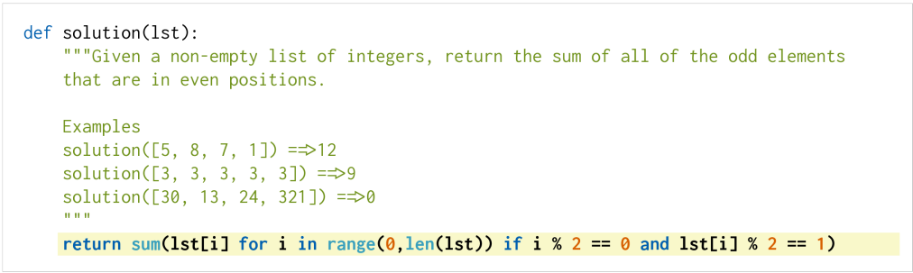

# Evaluating HumanEval


## Introduction
This is an evaluation harness for the HumanEval problem solving dataset described in the paper "Evaluating Large Language Models Trained on Code". It used to measure functional correctness for synthesizing programs from docstrings. It consists of 164 original programming problems, assessing language comprehension, algorithms, and simple mathematics, with some comparable to simple software interview questions.[[1]](https://paperswithcode.com/paper/evaluating-large-language-models-trained-on)


This is known as the most popular benchmarks in code generation, our Xwin-Coder models have surpassed every published open source model. Xwin-Coder-34B has reached **pass@1=74.2**. 

| Model | Model Size |  Open Source |  Pass@1 | Pass@10 | Pass@100 |
|----|----|----|----|----|----|
| CodeLLaMA-Instruct[[2]](https://arxiv.org/pdf/2308.12950.pdf) | 7B |  √  | 34.8  | 64.3 | 88.1 |
| **XwinCoder** | 7B |  √  | **63.8**  | **83.8**  | **94.1**  |
|-------------------------|-------------|---------------|--------|----------|------------|
| InstructCodeT5+[[3]](https://arxiv.org/pdf/2305.07922.pdf) | 16B |  ×  | 35.0 | - | - |
| CodeLLaMA-Instruct[[2]](https://arxiv.org/pdf/2308.12950.pdf) | 13B |  √  | 42.7 | 71.6 | 91.6 |
| WizardCoder[[3]](https://arxiv.org/pdf/2306.08568.pdf) | 15B |  √  | 57.3 | 73.3 | 90.5 |
| PanGu-Coder 2[[4]](https://arxiv.org/pdf/2307.14936.pdf) | 15B |  ×  | 61.6  | 79.6 | 90.5 |
| **XwinCoder** | 13B |  √  | **68.8**  | **88.2**  | **95.1** |
|-------------------------|-------------|---------------|--------|----------|------------|
| CodeLLaMA-Instruct[[2]](https://arxiv.org/pdf/2308.12950.pdf) | 34B |  √  | 41.5  | 77.2 | 93.5 |
| UnNatural-CodeLLaMA[[2]](https://arxiv.org/pdf/2308.12950.pdf) | 34B |  ×  | 62.2 | 85.2 | **95.4** |
| GPT-3.5-Turbo[[5]](https://github.com/deepseek-ai/deepseek-coder) | - |  ×  | 76.2  | -  | -  |
| GPT-4[[5]](https://github.com/deepseek-ai/deepseek-coder) | - |  ×  | **84.1**  | -  | -  |
| **XwinCoder** | 34B |  √  | 74.2  | **90.1**  | 94.8  |

## How to Evaluate
Our evaluation code was modified from wizardcoder's repository, which was further modified from CodeT5. To evaluate our model, You should first set the following variables:
```bash
model=<model name or path>
temp=<temperature to eval>
pred_num=<samples per problem>
num_seqs_per_iter=<generate batch size>
```
There are 3 combinations we suggest:
1. `temp=0, pred=1`: This is a fast greedy decode version to evaluate the model's performance, it should give a similar (±3%) result of pass@1.
2. `temp=0.2, pred=40`: This is the setting that we evaluate our pass@1 results in the above table.
3. `temp=0.8, pred=200`: This is the setting to reproduce our pass@10 and pass@100 results in the above table.

Finally run:
```Bash
Bash eval_humaneval.sh
```