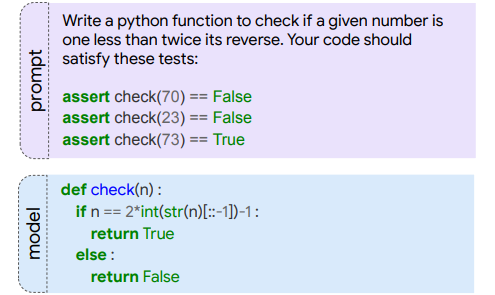

# Evaluating MBPP



## Introduction

The benchmark consists of around 1,000 crowd-sourced Python programming problems, designed to be solvable by entry-level programmers, covering programming fundamentals, standard library functionality, and so on. Each problem consists of a task description, code solution and 3 automated test cases.[[1]](https://github.com/google-research/google-research/tree/master/mbpp)

Our Xwin-Coder reached highest pass@1 accuracy among open source published models in every size:

| Model | Model Size |  Open Source |  Pass@1 | Pass@10 | Pass@100 |
|----|----|----|----|----|----|
| CodeLLaMA-Instruct[[2]](https://arxiv.org/pdf/2308.12950.pdf) | 7B |  √  | 44.4 | 65.4 | 76.8 |
| **XwinCoder**  | 7B |  √  |  **57.4** | **73.0** | **83.7** |
|-------------------------|-------------|---------------|--------|----------|------------|
| CodeLLaMA-Instruct[[2]](https://arxiv.org/pdf/2308.12950.pdf) | 13B |  √  | 49.4 | 71.2 | **84.1** |
| WizardCoder[[3]](https://arxiv.org/pdf/2306.08568.pdf) | 15B |  √  | 51.8 | - | - |
| **XwinCoder** | 13B |  √  |  **60.1**  | **74.6**  | 83.9  |
|-------------------------|-------------|---------------|--------|----------|------------|
| CodeLLaMA-Instruct[[2]](https://arxiv.org/pdf/2308.12950.pdf) | 34B |  √  |  57.0  | 74.6 | 85.4 |
| UnNatural-CodeLLaMA[[2]](https://arxiv.org/pdf/2308.12950.pdf) | 34B |  ×  | 61.2  | **76.6**  |  **86.7**  |
| GPT-3.5-Turbo[[4]](https://github.com/deepseek-ai/deepseek-coder) | - |  ×  |  70.8  | -  | -  |
| GPT-4[[4]](https://github.com/deepseek-ai/deepseek-coder) | - |  ×  | **80.0**  | -  | -  |
| **XwinCoder** | 34B |  √  | 64.8  | 75.7  | 84.3  |

## How to Evaluate

### 1. Generate Responses
The generation settings are the same as [HumenEval](../HumanEval):
```Bash
Bash generate_MBPP.sh
```
### 2. Check Correctness
We use [bigcode-evaluation-harness](https://github.com/bigcode-project/bigcode-evaluation-harness) to safely execute and verify the generated code. We suggest building their docker directly:

```bash
sudo docker pull ghcr.io/bigcode-project/evaluation-harness-multiple
sudo docker tag ghcr.io/bigcode-project/evaluation-harness-multiple evaluation-harness-multiple
sudo docker run -it -p 8022:22 -d --name=<name> --privileged --net=host --ipc=host --gpus=all -v /:/data evaluation-harness-multiple
sudo docker exec -it <name> bash
```

Note that this will mount your `/` dir into `/data`. You will be in the workspace after you execute the above commends, then you can run:
```bash
accelerate launch  main.py --tasks mbpp --load_generations_path /data/<your_path_to>/xwin_coder_eval/generation_for_harness/<eval_file_name>.jsonl --model <name_only_for_documentation> --allow_code_execution --n_samples <samples per problem>
```
This will return a result like:
```
{
  "mbpp": {
    "pass@1": 0.6479905437352247,
    "pass@10": 0.7186761229314421
  },
  "config": {
    "model": "<name_only_for_documentation>",
    "temperature": 0.2,
    "n_samples": 10
  } 
} 
```
