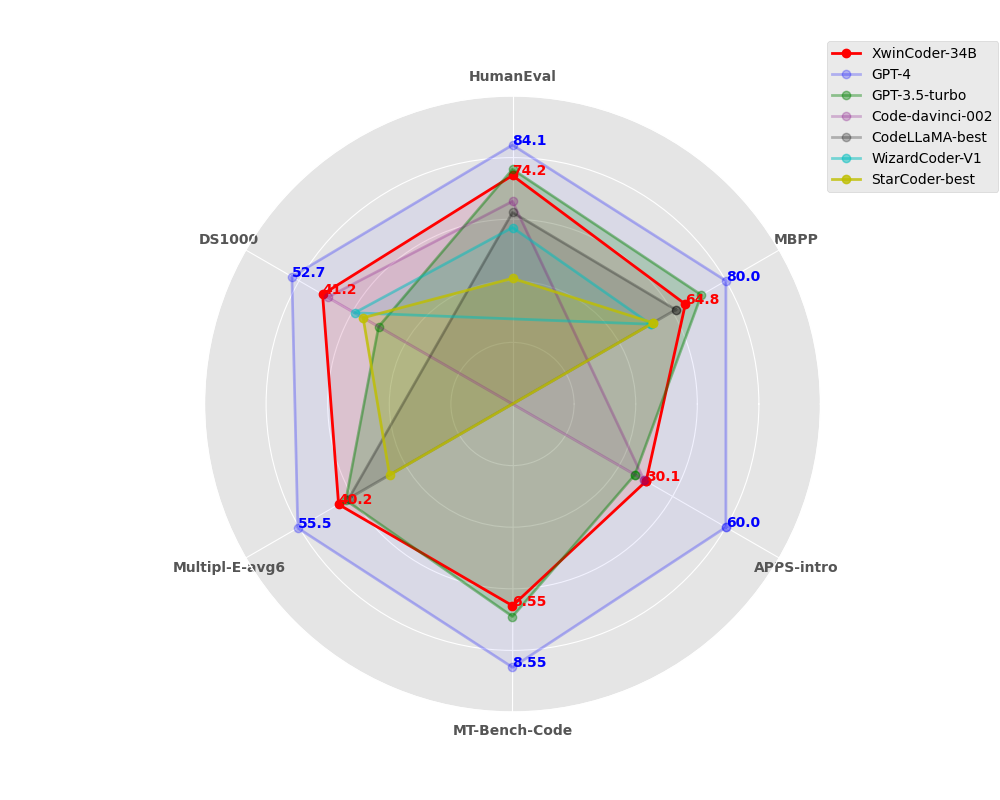

# XwinCoder Eval

This folder is used to evaluate and reproduce the results of our code assistent model XwinCoder: A series of models that are instruction-finetuned from open-source pretrained models. Also, this folder can serve as a complete codebase for evaluating code-related capabilities of instruction finetuned models, whereas existing codebases like [bigcode-evaluation-harness](https://github.com/bigcode-project/bigcode-evaluation-harness/tree/main) are mainly designed for pretrained base models. To facilitate the researchers to do ablation experiments and decrease set-up burden, we seperate the evaluation of each task instead of integrating them into a single framework. 

## Updates

- We released  [**XwinCoder-7B**](https://huggingface.co/Xwin-LM/XwinCoder-7B), [**XwinCoder-13B**](https://huggingface.co/Xwin-LM/XwinCoder-13B), [**XwinCoder-34B**](https://huggingface.co/Xwin-LM/XwinCoder-34B). Our XwinCoder-34B reached **74.2** on HumanEval and it achieves comparable performance as GPT-3.5-turbo on 6 benchmarks.

- We support codebase to evaluate instruction finetuned models on [HumanEval](HumanEval/README.md), [MBPP](MBPP/README.mb), [APPS](APPS/README.mb), [DS1000](DS1000/README.mb) and [MT-Bench](MT_bench/README.mb). 

## Overview



* To fully demonstrate our model's coding capabilities in real-world usage scenarios, we have conducted thorough evaluations on several existing mainstream coding capability leaderboards (rather than only on the currently most popular HumanEval).   
* As shown in the radar chart, our 34B model **achieves comparable performance as GPT-3.5-turbo on benchmarks**. Note that, to ensure accurate visualization, our radar chart has not been scaled (only translated; MT-Bench score is scaled by 10x to be more comparable with other benchmarks).
* Multiple-E-avg6 refer to the 6 languages used in CodeLLaMA paper. Results of GPT-4 and GPT-3.5-turbo are conducted by us, more details will be released later.

### Training data

We include multiple sources of instruction data in our finetuning. Here are some information about the component of our training data:

| Category | Explanation | Used tokens | Ratio |
|----|----|----|----|
| Instruction | General instruction data related to code, without any intersection with all <br> benchmarks' train and test set. | 403.4M | 0.694 |
| Code Problem | Train set of APPS dataset, we prompt GPT-4 to generate CoT for those solutions. | 34.5M | 0.038 |
| Math | PoT part of [Mammoth](https://huggingface.co/datasets/TIGER-Lab/MathInstruct)'s data | 111.8M | 0.252 |
| Self-consciousness | Tell the models who they are. | 2.6M | 0.016 |
| Total |  | 552.3M |  |

## Contents

1. [Setting Up](#setting-up)
2. [Chat Demo](#chat-demo)
3. [Evaluation](#evaluation)
4. [Further Details](#further-details)

## Setting Up

We will use [vllm](https://github.com/vllm-project/vllm) to generate responses during all evaluations. This library will update your pytorch into version 2.0+. So we suggest starting with a docker that support higher version of CUDA and pytorch. For example:

```bash
sudo docker run -it -p 8022:22 -d --name=<docker name> --privileged --net=host --ipc=host --gpus=all -v /:/data superbench/dev:cuda11.8 bash
sudo docker exec -it <docker name> bash
```
Then, run:
```bash
pip install -r requirements.txt
```
This will install all packages needed during generation. For [DS1000](DS1000/README.md), [Multipl-E](Multipl_E/README.md) and [MBPP](MBPP/README.md), We only generate responses using this docker, execution and evaluation will be done in another envirenment or repository. You can check README.md in the folder of each task for further details.

❗Note: the latest vllm does not support running on H100 yet, if you want to evaluate using H100, tag vllm=0.1.7 in the `requirements.txt`. 

## Chat Demo

We provide a chat demo for you to quick check the generation performance. Run:
```bash
python online_chat.py --model <model path or name>
```
and you can interact with our models. 

Here are some examples:


## Evaluation

As mentioned before, this repository is targeting instruction finetuned models. For all tasks, we provide generation codes that modify tasks into forms that align with the intructions used in the models and generate. Then the generated responses are processed into forms of evaluators. The evaluators, including code execution and checking correctness, are adapted from original benchmark websites or directly use [bigcode-evaluation-harness](https://github.com/bigcode-project/bigcode-evaluation-harness/tree/main) to ensure correctness and fairness.

Specific evaluation scripts are in the folder of each task.

## Others

1. Known issues:
    - As our models are trained on the newest torch and transformers, it was observed that evaluating on torch 1.x and very old version of transformers may cause a 2-3% drop on results.
    - Because there are no general multi-turn chat data used in current version of XwinCoder, they may not comparable with GPT-3.5-turbo on multi-turn chat and general instruction following. We only state that they are comparable on coding ability and benchmarks.
    - Evaluation code for Multipl-E will be released later.
