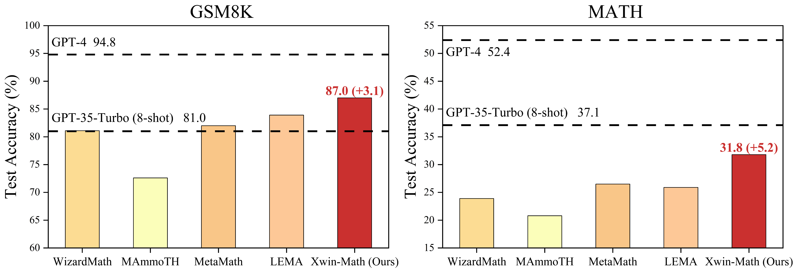

# Xwin-Math

<div align="center">
  
</div>

This repo introduces Xwin-Math, a series of powerful SFT LLMs for math problem based on LLaMA-2. Moreover, it also includes an evaluation toolkit that better converts LaTeX formulas into SymPy objects, enabling more accurate assessment of the mathematical abilities.


## 🔥 News
- :boom: [Nov, 2023] The [Xwin-Math-70B-V1.0](https://huggingface.co/Xwin-LM/Xwin-Math-70B-V1.0) model achieves **31.8 pass@1 on the MATH benchmark** and **87.0 pass@1 on the GSM8K benchmark**. This performance places it first amongst all open-source models!
- :boom: [Nov, 2023] The [Xwin-Math-7B-V1.0](https://huggingface.co/Xwin-LM/Xwin-Math-7B-V1.0) and [Xwin-Math-13B-V1.0](https://huggingface.co/Xwin-LM/Xwin-Math-13B-V1.0) models achieve **66.6 and 76.2 pass@1 on the GSM8K benchmark**, ranking as top-1 among all LLaMA-2 based 7B and 13B open-source models, respectively!


## ✨ Model Card
|  Model  |  GSM8K  |  MATH  |  Checkpoint  |  License  |
|:-:|:-:|:-:|:-:|:-:|
|Xwin-Math-7B-V1.0 |  66.6  |  17.4  | 🤗 <a href="https://huggingface.co/Xwin-LM/Xwin-Math-7B-V1.0" target="_blank">HF Link</a> | <a href="https://ai.meta.com/resources/models-and-libraries/llama-downloads/" target="_blank">Llama 2 License|
|Xwin-Math-13B-V1.0|  76.2  |  21.7  | 🤗 <a href="https://huggingface.co/Xwin-LM/Xwin-Math-13B-V1.0" target="_blank">HF Link</a> |  <a href="https://ai.meta.com/resources/models-and-libraries/llama-downloads/" target="_blank">Llama 2 License|
|Xwin-Math-70B-V1.0|  87.0  |  31.8  | 🤗 <a href="https://huggingface.co/Xwin-LM/Xwin-Math-70B-V1.0" target="_blank">HF Link</a> |  <a href="https://ai.meta.com/resources/models-and-libraries/llama-downloads/" target="_blank">Llama 2 License|

## 🚀 Benchmarks
### Xwin-Math performance on [MATH](https://github.com/hendrycks/math) and [GSM8K](https://github.com/openai/grade-school-math).

Xwin-Math-70B-V1.0 has achieved **31.8% on MATH** and **87.0% on GSM8K**. These scores are **5.3** and **3.1** points higher, respectively, than the previous state-of-the-art open-source MetaMath and LEMAv1 model.


| **Model** |**MATH (Our test)** | **GSM8K (Our test)** |
|:-:|:-:|:-:|
|  GPT-4 (zero-shot)    |  52.4  |  94.8  |
|  GPT-35-Turbo (8-shot)|  37.1  |  81.0  |
| |
|  WizardMath-70B       |  23.9  |  81.1  |
|  MAmmoTH-70B          |  20.8  |  72.6  |
|  MetaMath-70B         |  26.5  |  82.0  |
|  LEMAv1-70B           |  25.9  |  83.9  |
|**Xwin-Math-70B-V1.0** |**31.8**|**87.0**|
| | 
|  WizardMath-13B       |  15.0  |  63.7  |
|  MAmmoTH-13B          |  12.3  |  56.2  |
|  MetaMath-13B         |  22.7  |  70.9  |
|  LEMAv1-13B           |  13.6  |  65.0  |
|**Xwin-Math-13B-V1.0** |  21.7  |  76.2  |
| |
|  WizardMath-7B        |  10.9  |  55.0  |
|  MAmmoTH-7B           |  9.6   |  50.2  |
|  MetaMath-7B 			    |  20.1  |  66.6  |
|  LEMAv1-7B            |  10.0  |  54.7  |
|**Xwin-Math-7B-V1.0**  |  17.4  |  66.6  |

We obtain these results using our flexible evaluation strategy. Due to differences in environment and hardware, the numbers may be different from the reported results, but we ensure that the evaluation is as accurate and fair as possible.

### Xwin-Math performance on other math benchmarks.

Our 70B model shows strong mathematical synthesis capabilities among all open-sourced models. Also note that our model even approaches or surpasses the performance of GPT-35-Turbo on some benchmarks.

| **Model** | SVAMP | ASDiv | NumGlue | Algebra | MAWPS | **Average** |
|:-:|:-:|:-:|:-:|:-:|:-:|:-:|
|  GPT-35-Turbo (8-shot)|  80.6  |  84.1  |  81.8  |  90.5  |  91.7  |  85.7  |
| |
|  WizardMath-70B       |  80.2	 |  75.8  |  71.4  |  64.0  |  74.9  |  73.3  |
|  MAmmoTH-70B 	        |  71.2	 |  73.9  |  62.7  |  58.1  |  72.2  |  67.6  |
|  MetaMath-70B         |  85.8  |  81.1  |  77.5  |  79.7  |  81.4  |  81.1  |
|  LEMAv1-70B-MATH *    |  81.6  |  77.1  |  72.1  |  69.4  |  81.8  |  76.5  |
|**Xwin-Math-70B-V1.0** |  84.0  |  84.1  |  81.3  |  78.4  |  90.8  |  83.7  |

\* LEMAv1 has two models, and we report the better LEMAv1-70B-MATH model in these benchmarks.

## 🔨 Evaluation
In order to evaluate a model's mathematical capabilities more flexibly and ensure a fair comparison of results, particularly for the MATH benchmark, we have developed a new evaluation tool. We have also assessed the pass@1 results of recent models on MATH and GSM8K benchmarks, which provides more accurate results.

We hope this toolkit can benefit open-source community by providing more accurate insights and conclusions. For a deeper understanding of our evaluation tool and methods, please visit [here](./eval)

* "Report" refers to the accuracy stated in the original papers.
* "Repro" indicates the results is reproduced by generating responses and evaluating them using the respective open-source models and scripts.
* "Strict" and "Flex" denote the results we achieved by employing our two answer extraction strategies and evaluate the same responses as "Repro".

| Model | MATH <br> (Report) <br/> |MATH <br> (Repro) <br/> | MATH <br> (Strict) <br/>  |MATH <br> (Flex) <br/> | GSM8K <br> (Report) <br/> |GSM8K <br> (Repro) <br/>|  GSM8K <br> (Strict) <br/> |  GSM8K <br> (Report) <br/> |
|:-:|:-:|:-:|:-:|:-:|:-:|:-:|:-:|:-:|
|  GPT-35-Turbo (8-shot)|  34.1  |  -     |  23.8  |  37.1  |  80.8  |  -     |  77.9  |  81.0  |
| |
|  WizardMath-70B       |  22.7  |  23.0  |  23.9  |  23.9  |  81.6  |  81.4  |  81.1  |  81.1  |
|  MAmmoTH-70B          |  21.1  |  18.0  |  20.0  |  20.8  |  72.4  |  72.6  |  72.6  |  72.6  |
|  MetaMath-70B         |  26.6  |  25.9  |  26.3  |  26.5  |  82.3  |  82.3  |  82.0  |  82.0  |
|**Xwin-Math-70B-V1.0** |  -     |  -     |**31.8**|**31.8**|  -     |  -     |**87.0**|**87.0**|
| | 
|  WizardMath-13B       |  14.0  |  14.2  |  14.9  |  15.0  |  63.9  |  63.9  |  63.7  |  63.7  |
|  MAmmoTH-13B          |  12.9  |  10.8  |  11.8  |  12.3  |  56.3	 |  56.2  |  56.1  |  56.2  |
|  MetaMath-13B         |  22.4  |  22.5  |  22.6  |  22.7  |  72.3	 |  71.0  |  70.9  |  70.9  |
|**Xwin-Math-13B-V1.0** |  -     |  -     |  21.6  |  21.7  |  -     |  -     |  76.2  |  76.2  |
| |
|  WizardMath-7B        |  10.7  |  10.3  |  10.9  |  10.9  |  54.9  |  55.2  |  55.0  |  55.0  |
|  MAmmoTH-7B           |  10.4  |  8.6   |   9.1  |  9.6   |  50.5  |  50.2  |  50.2  |  50.2  |
|  MetaMath-7B          |  19.8  |  19.6  |  19.9  |  20.1  |  66.5  |  66.6  |  66.6  |  66.6  |
|**Xwin-Math-7B-V1.0**  |  -     |  -     |  17.3  |  17.4  |  -     |  -     |  66.6  |  66.6  |

### Installation

Before you start, please install the requirements. 

```bash
pip install -r requirements.txt
```

We tested our result using `python 3.8` and `cuda 11.8`. We recommend you use docker.
```bash
docker run --gpus all -it --rm --ipc=host superbench/dev:cuda11.8
```

### Generate

To generate the model's responses, you can use the `generate.py` script. Please be aware that generating responses is separate from verifying their correctness. After that, we will then check for their correctness.

For the generation process, we use the Vicuna-v1.1 system prompt with chain-of-thought and format instruction. We also employ a greedy decoding strategy and set the maximum sequence length to 2048.
```
"A chat between a curious user and an artificial intelligence assistant. The assistant gives helpful, detailed, and polite answers to the user's questions. USER: {instruction} Give your solution in detail. In the end, write your final answer in the format of 'The answer is: <ANSWER>.'. ASSISTANT: "
```

Here is an simple example to generate using [vLLM](https://docs.vllm.ai/en/latest/).
```bash
cd eval

python generate.py --dataset_path dataset/gsm8k.json --model_path path/to/your/model --tensor_parallel_size 4
```
By default the results will be output to the `eval/response`, using the prompt `eval/prompt/xwin_math.json`. If you wish to change the output path or use a different prompt
```bash
python generate.py --dataset_path dataset/gsm8k.json --model_path path/to/your/model --tensor_parallel_size 4 --output_path /your/path --prompt_path /your/path
```


We provide some datasets (in `eval/dataset`):
- `gsm8k.json`: GSM8K. 
- `math.json`: MATH. 
- `combination.json`: A combination of many benchmarks, can evaluate the OOD capability of the model. 

If you wan't to use your own datasets, please format your dataset like this. 

```jsonc
[
    {
        "question": "Janet\u2019s ducks lay 16 eggs per day. She eats three for breakfast every morning and bakes muffins for her friends every day with four. She sells the remainder at the farmers' market daily for $2 per fresh duck egg. How much in dollars does she make every day at the farmers' market?",
        "answer": "18",
        "type": "GSM8K",
        "subtype": "",
        "level": 0,
    },
    // ... more data items
]
```


### Evaluate

To verify the accuracy of the answers after generation, you can use the `check.py script.

Here is an simple example
```bash
cd eval

python eval.py /path/to/model/response
```
The result will be saved in `eval/evaluation`

If you do not want to save the results or want to change the save path
```bash
python eval.py --data_path /path/to/model/response --save_path /path/to/save --save_result True
```

Once you run the script, the terminal will display the output as a table. This table will show the number of instances for each benchmark and the corresponding accuracy. Here is a hypothetical example of what the output might look like:

||Type|Subtype|Level|Correct|Incorrect|Total|Accuracy|
|---|---|---|---|---|---|---|---|
|0|MAWPS|addsub|0|359|33|392|0.915816|
|1|MAWPS|multiarith|0|586|14|600|0.976667|
|...|


## Citation
Please consider citing our work if you use the data or code in this repo.
```
@software{xwin-math,
  title = {Xwin-Math},
  author = {Xwin-Math Team},
  url = {https://github.com/Xwin-LM/Xwin-LM/Xwin-Math},
  version = {pre-release},
  year = {2023},
  month = {11},
}
```

## Acknowledgements

Thanks to [Llama 2](https://ai.meta.com/llama/), [FastChat](https://github.com/lm-sys/FastChat), and [vLLM](https://github.com/vllm-project/vllm).
