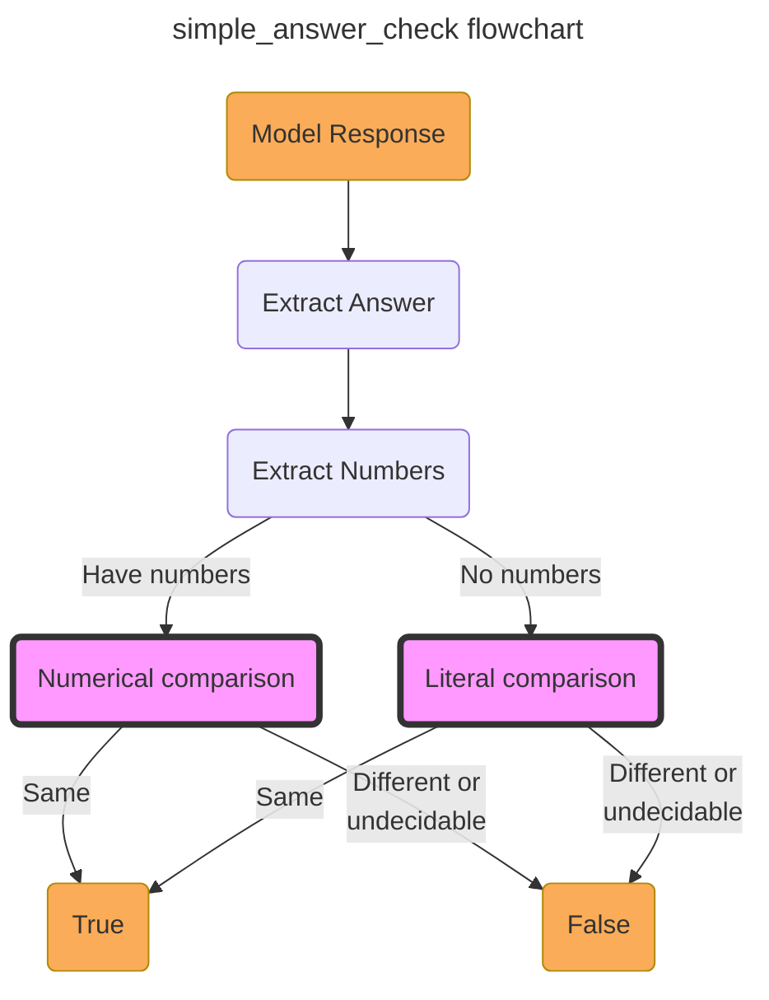
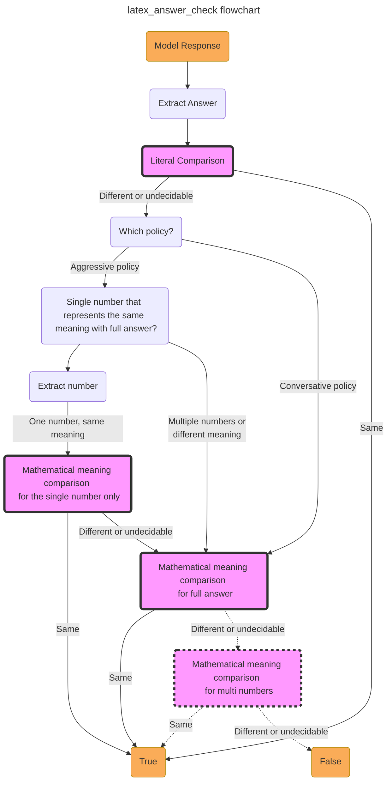

# Evaluation Tool for Math Tasks

## Motivation

We've recognized the critical role of consistent and accurate evaluation methods in fostering correct conclusion. For instance, during the assessment of GPT-35-Turbo, we observed substantial discrepancies resulting from the use of different evaluation scripts. Furthermore, it's become evident that some works do not strictly adhere to a consistent evaluation strategy when reporting their results. Such inconsistencies can not only skew comparisons but also lead to incorrect experimental conclusions.

|Model|Dataset|WizardMath's Script|Ours (strict)|Ours (flex)|
|:-:|:-:|:-:|:-:|:-:|
|GPT-35-Turbo|Math     | 22.7 | 23.8 | 37.1 |
|GPT-35-Turbo|GSM8K    | 78.1 | 77.9 | 81.0 |

Therefore, we found it necessary to develop our new evaluation script, designed to maintain evaluation consistency and ensure more accurate and fair comparisons across the board. Consequently, we adopt the advantages of many open-source methods to establish a fairer and more flexible evaluating method. Hopefully, this can be used to advance the open source community forward in mathematical reasoning. 

## Main Features

Our test scripts have the following features:

* More flexible stretegy to extract answer from model response.
* Use SymPy to represent LaTeX code insteading string matching to better determine the mathematical consistency.
* Configurable flexibility strategies for different problems.

While we hope to cover as many scenarios as possible, we acknowledge that the evaluation of mathematical problems can be complex and challenging to perfect. Occasionally, the answers generated by the models need to be interpreted within their specific contexts, which is a task beyond the capabilities of this simple rule-based scripts. However, for most cases, our tool is already adept at providing flexible judgment.

Your feedback is invaluable to us. If you encounter any issues with the scripts, please don't hesitate to inform us. We truly appreciate your contribution!

## Results

We evaluate recent models' pass@1 results on MATH and GSM8K benchmarks. 
* "Report" refers to the accuracy stated in the original papers.
* "Repro" indicates the results is reproduced by generating responses and evaluating them using the respective open-source models and scripts.
* "Strict" and "Flex" denote the results we achieved by employing our two answer extraction strategies and evaluate the same responses as "Repro".

| Model | MATH   (Report)   |MATH   (Repro)   | MATH   (Strict)    |MATH   (Flex)   | GSM8K   (Report)   |GSM8K   (Repro)  |  GSM8K   (Strict)   |  GSM8K   (Report)   |
|:-:|:-:|:-:|:-:|:-:|:-:|:-:|:-:|:-:|
|  GPT-35-Turbo (8-shot)|  34.1  |  -     |  23.8  |  37.1  |  80.8  |  -     |  77.9  |  81.0  |
| |
|  WizardMath-70B       |  22.7  |  23.0  |  23.9  |  23.9  |  81.6  |  81.4  |  81.1  |  81.1  |
|  MAmmoTH-70B          |  21.1  |  18.0  |  20.0  |  20.8  |  72.4  |  72.6  |  72.6  |  72.6  |
|  MetaMath-70B         |  26.6  |  25.9  |  26.3  |  26.5  |  82.3  |  82.3  |  82.0  |  82.0  |
|**Xwin-Math-70B-V1.0** |  -     |  -     |**31.8**|**31.8**|  -     |  -     |**87.0**|**87.0**|
| | 
|  WizardMath-13B       |  14.0  |  14.2  |  14.9  |  15.0  |  63.9  |  63.9  |  63.7  |  63.7  |
|  MAmmoTH-13B          |  12.9  |  10.8  |  11.8  |  12.3  |  56.3	 |  56.2  |  56.1  |  56.2  |
|  MetaMath-13B         |  22.4  |  22.5  |  22.6  |  22.7  |  72.3	 |  71.0  |  70.9  |  70.9  |
|**Xwin-Math-13B-V1.0** |  -     |  -     |  21.6  |  21.7  |  -     |  -     |  76.2  |  76.2  |
| |
|  WizardMath-7B        |  10.7  |  10.3  |  10.9  |  10.9  |  54.9  |  55.2  |  55.0  |  55.0  |
|  MAmmoTH-7B           |  10.4  |  8.6   |   9.1  |  9.6   |  50.5  |  50.2  |  50.2  |  50.2  |
|  MetaMath-7B          |  19.8  |  19.6  |  19.9  |  20.1  |  66.5  |  66.6  |  66.6  |  66.6  |
|**Xwin-Math-7B-V1.0**  |  -     |  -     |  17.3  |  17.4  |  -     |  -     |  66.6  |  66.6  |

When applied to the MATH benchmark, our pipeline consistently yields improved results in comparison to those obtained using the original evaluation scripts. This improvement primarily stems from our method of converting the LaTeX code into SymPy objects. This approach allows for a comparison of the consistency of mathematical formulas, rather than simple string matching. To illustrate this, consider the following example:
> If the ground truth answer is $7(x - 3)(x + 3)$, then both $7(x + 3)(x - 3)$ and $7x^2 - 63$ should be correct. However, string matching would erroneously judge them as incorrect.

Contrastingly, when applied to the GSM8K benchmark, our pipeline's results either matched or slightly fell short of those obtained using the original evaluation scripts. This discrepancy is primarily due to the original scripts converting both the model's answers and the reference answers into integers, which results in false negatives.

Thus, our pipeline demonstrates a more nuanced approach to evaluating model outputs, particularly with mathematical formulas.

## Details

In this section, we shed light on the inspirations behind our designs, the methods we employed, and potential challenges that might be encountered with each design. 

### Overview

Let's start with a general overview of our evaluation process. We divided the problems into two main categories, simple math problems, represented by GSM8K and problems that involve more math and use LaTeX, represented by MATH. 

For the former category, we use `simple_answer_check` to check the correctness. The process is illustrated below. 

*To keep the flowchart simple, steps are omitted or combined, only the conditional branches are kept.*

We first extract the answer and the numbers, and compare the numbers if exists, otherwise we do character-by-character matching. 

For the latter category, we use `latex_answer_check` to check the correctness. The process is illustrated below. 

First, we extract the answers and numbers, then try to match them character by character. If the strategy is aggressive and an extraction is possible, we extract numbers for an extra comparison. 

*The part within the dashed box has not yet been implemented.*

### Extract answers flexibly

We employ a diverse range of methods to extract answers from the model's responses. Certain models, such as GPT-35-Turbo, the provision of answer format in the prompt and context examples may not always result in a singular response. Therefore, we implement multiple extraction methods to accurately assess the model's capabilities. The methods we use include:
1. Extracting text after pre-defined patterns such a "The answer is: " or "####".
2. Extracting text in the pattern of "\boxed{}" or "\mbox{}".
3. Extracting *The last number or formula* in the response.

The first guideline stems from the structure of the training data and shots. We expect the models to return the results following this same structure. The second guideline stems from the practices of specific models, which typically use "\boxed{}" to denote answers within the training data. The third guideline is implemented to accommodate instances when models do not output answers in a conventional manner. In such scenarios, we interpret the final number or formula in the overall response as the intended answer.

> For example, in this case we use rule 2 to extract answer. 
> - "The denominator of the fraction is $x^2+x-6=(x+3)(x-2)$. The function is undefined when the denominator is equal to zero, so there are vertical asymptotes at $x=-3$ and $x=2$. Therefore, the graph has $\boxed{2}$ vertical asymptotes."
>
> In this case we use rule 3 to extract answer.
> - "Each elephant has 4 legs, so 35 elephants have 35 * 4 = 140 legs. \n\nEach tiger has 4 legs, so 48 tigers have 48 * 4 = 192 legs. \n\nIn total, I see 140+192=332 legs. \n\nTherefore, I see 332 legs. "

Experimentally, the addition of rule 2 and 3 have small effect on SFT models, but have a very large effect on general LLMs such as GPT-35-Turbo. 

The extraction strategy can be modified by setting `extract_policy` in `eval_config.json` for different datasets. 
- In `strict` mode we will only use rule 1. 
- In `flex` model we will combine three rules together.  

If you want to include more patterns in rule 1, please modify `extract_pattern` in `config.json`. 

> [!WARNING]
> The first two rules are generally not problematic, but the last rule can sometimes lead to **incorrect judgments**. Because we can't be sure that the last number of the entire response represents the answer. 

### The same mathematical meaning is sufficient

We use `SymPy`'s `parse_latex` function to get mathematical expressions. This is because mathematical answers can be expressed in a variety of forms. We don't want our model to be limited to a particular form of representation. 

> For example: 
> - 3/7 , $\frac{3}{7}$ and 0.428571
> - $x + y$ and $y + x$ 
> - $(x - 3)(x + 3)$ , $(x + 3)(x - 3)$ and $x^2 - 9$
> - $\frac{3x + 4}{3}$ and  $x + \frac{4}{3}$

> [!WARNING]
> This could introduce **controversy**. The results of some models are not reduced to the simplest form, but will be judged to be correct.
>
> For example: 
> - $\sqrt{169}$ and $13$
> - $\frac{\sin x}{\sin x}$ and $1$

### Set reasonable tolerance for floating point numbers.

Unlike computers, LLM has the same habits with people and usually has rounding error when dealing with floating point numbers. This made the usual procedures for determining the equality of floating point numbers not suitable here. So we need to set the error range and show tolerance to these cases. 

> Consider the following scenarios:
> - Calculate the volume of solution needed: "15.97 ml" and "15.9699"
> - Calculate the price of a commodity: "$1.33" and "1.333333"

When dealing with simple problems such as GSM8K, some works directly convert all answers to integers for further judgment. This could also lead to wrong judgments. After experimentation we decided to use **1e-3 relative tolerance**.

It is worth noting that the above strategy does not apply to integers. If both the model-generated answer and the original answer are integers, then we require them to be exactly identical. 

> [!WARNING]
> This could lead to **wrong judgments**. Sometimes we require answers to be exact or the answer should not be a decimal.
> 
> Consider the following scenarios:
> - Calculate the probability of a certain event: "$\frac{2^{16} - 1}{2^{16}}$" and "1"
> - Calculate the number of apples: "1" and "1.0035"

### Use configurable strategies for different problems

For simple math application problems, we use `simple_answer_check` to check the correctness. 

First we will extract all the numbers in the model output and the ground truth, then compare all these numbers, and finally judge the correctness based on one of these polices:
- `strict`
- `model_include_gt`
- `gt_include_model`

`strict` requires a one-to-one correspondence between the response and ground-truth, but does not require the sequence to be the same. `model_include_gt` only requires that the numbers in model response contain all the numbers in ground_truth, and `gt_include_model` vice versa. 

> For example, the reference answer is: "400, 200"
> - `strict`. We except the model generateed response to be:
>   - "...The answer is: 200 ml and 400 ml. " or
>   - "...The answer is: 400 ml and 200 ml. "
> - `model_include_gt`. Sometimes the model outputs some additional numbers, in which case the `model_include_gt` will be more accurate. The following response will be considered correct. 
>   - "...The answer is: 200 ml of 5% alcohol and 400ml of 10% alcohol. "
> - `gt_include_model`. In rare cases, the labeling of the dataset does not match the question asked in the question, for example, the question only asks how many 10% solutions are needed, but the reference answer gives both 10% and 5%. In such cases, this strategy should be adopted. 

In practice, the first two strategies should be used in combination; `strict` is usually sufficient when dealing with single-solution problems such as GSM8K, while `model_include_gt` is usually better when facing multiple-solution problems. 

For MATH which involves more knowledge and uses LaTeX, we adopt `latex_answer_check` to check the correctness, this method provides 2 polices. 

- `aggressive`
- `conversative`

In the checking process, we would like to take the same idea of extracting the numbers and then comparing them. But unlike `simple_answer_check`, sometimes we require the numbers to be in the same order. 

The difference between two policies is how the numbers are extracted. In `aggressive` mode, we will extract numbers from the answers for comparison. But in `conservative` mode, We will use SymPy to parse the entire answer.

> For example, in `aggressive` mode: 
>   - Ground Truth: "400"
>   - Model response: "...The answer is: 400 \text{meters}"
>   - Answer section: "400 \text{meters}"
>   - **Extract number: "400 \text{meters}" -> "400"**
>   - Comparison: "400" <-> "400"
>
> In `conservative` mode: 
>   - Ground Truth: "400"
>   - Model response: "...The answer is: $400 \text{meters}$"
>   - Answer section: "400 \text{meters}"
>   - Comparison: "400 \text{meters}" <-> "400"

We consider the `aggressive` mode to be risky, as sometimes the meaning of an answer is not solely represented by numbers.
> For example: 
> - $(-\infty, -5)$ and $[-5, +\infty)$

To mitigate this risk, in `aggressive` mode, further comparisons are only made when the remaining part of the answer, excluding the numbers, is sufficiently simple. That is to say, 
- No () [] {}. 
- No \ < >. 
- No x, y and z. 

The above strategy applies to single number. Now, let's consider the multiple number situation. The main scenarios are as follows. 
- Multiple answers: $\frac{13}{4}, \sqrt{12}, 5$
- Sets: $\{\frac{13}{4}, \sqrt{12}, 5\}$
- Intervals: $(-\infty, -5) \cup [2, +\infty)$ and $(-5, 2)$
- Vectors or Matrixs: $(\frac{13}{4}, \sqrt{12}, 5)$, $[\frac{13}{4}, \sqrt{12}, 5]$

For some cases such as vectors, the order of the numbers is important, while for sets or multiple answers the order is not. However, for intervals, simply having the same numbers in the same order is not enough.

This part is still in progress. Currently, we still rely on character-by-character matching to determine the correctness of multiple numbers. 
> For example, this form of answer will be judged as incorrect currently.
> $(-\infty, -\frac{13}{6}) \cup [2, +\infty)$ and $(-\infty, -13/6) \cup [2, +\infty)$

### Datasets

For certain questions that involve the knowledge of solving systems of linear equations, the labels provided are solutions to the equations, rather than the actual final answer. This means that the labeled numbers could be part of the actual answer or intermediary steps. 

Utilizing these datasets would inevitably result in a significant number of wrong judgements. Therefore, we have re-annotated these datasets.
- Simuleq in MAWPS
- Dolphin
- Kushman

These data are included in `eval/datasets/combination.json`.
